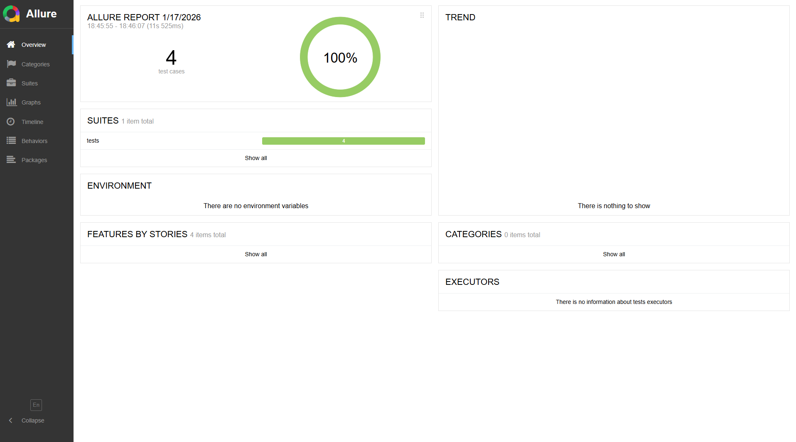
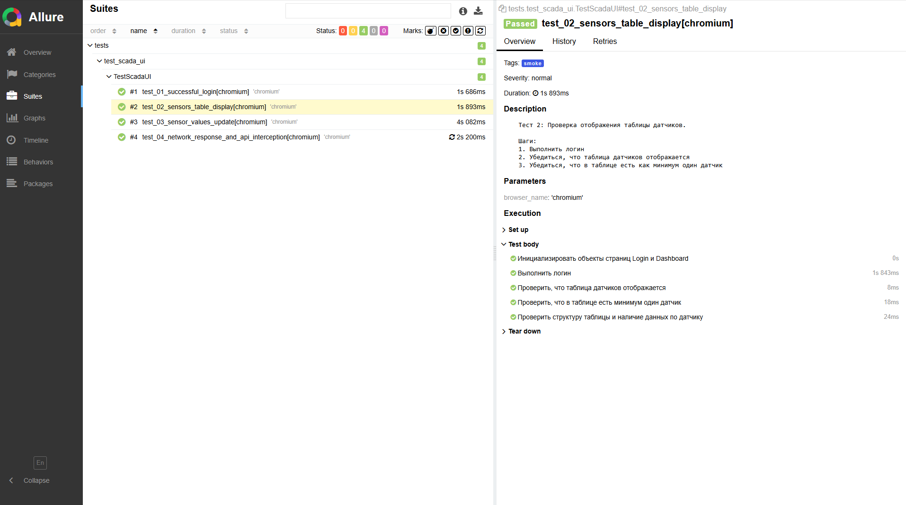
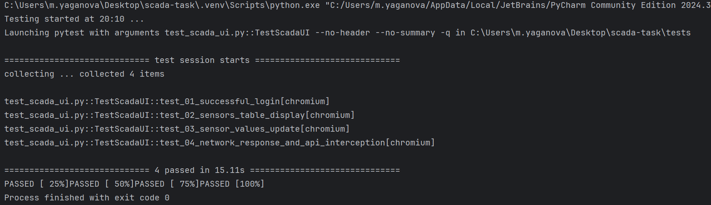
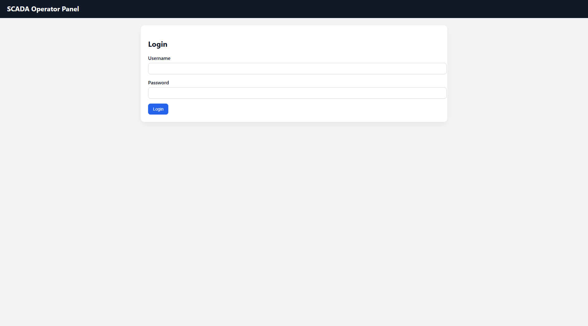
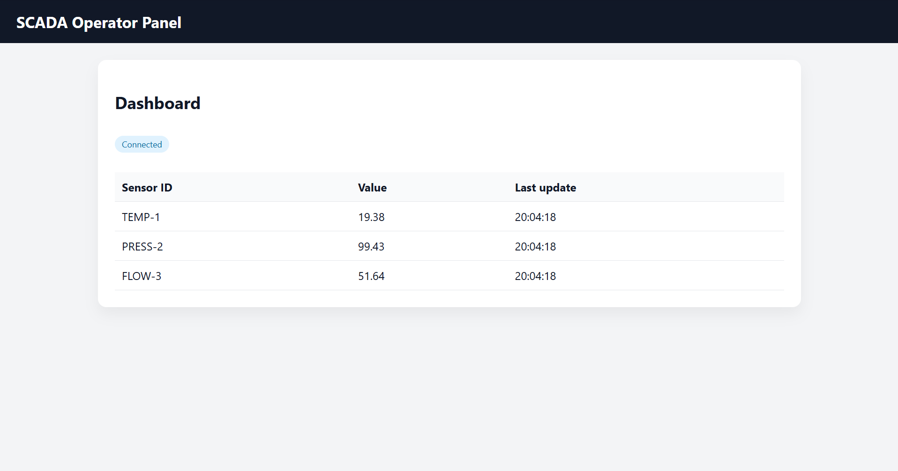

[](https://www.python.org/downloads/release/python-3100/)
[](https://playwright.dev/python/)
[](https://docs.pytest.org/)
[](https://playwright.dev/python/)
[](https://allurereport.org/)

# SCADA Operator UI — UI-тестирование (Playwright, Python)

Набор **автоматизированных UI-тестов** для веб-интерфейса оператора **SCADA** на **Playwright (Python)** с применением **Page Object**, встроенных ожиданий Playwright и формированием отчёта **Allure**. Тестовое задание в Systeme Electric.

Тестируемый интерфейс — локальная HTML-страница (`scada_ui.html`):  
- **форма логина**  
- **Dashboard** с **таблицей датчиков**  
- значения датчиков **обновляются раз в секунду**

---

## Условие

### Сценарии из ТЗ
1. **Логин**
   - ввести логин/пароль
   - убедиться, что пользователь авторизован (переход на Dashboard)

2. **Отображение данных**
   - таблица датчиков отображается
   - в таблице есть **минимум 1 датчик**

3. **Обновление значений**
   - значение датчика **меняется со временем**
   - проверяем **факт обновления**, а не конкретное число

4. **Сетевые ожидания и API-мокинг**
   - **Ожидание network-response** (`page.expect_response(...)`)
   - **Перехват API** (`page.route(...)/fulfill(...)`)
   - **Стабилизация флаков** (моки, storage_state для “предавторизации”, ожидания вместо sleep)


### Технические требования
- **Playwright (Python)**
- **Page Object** (страницы вынесены в `pages/`)
- Использовать:
  - `locator` / `get_by_test_id` / `get_by_role`
  - **встроенные ожидания** Playwright (`expect`, `wait_for`, `expect_response`)
- Запрещено:
  - `time.sleep`
  - жёсткие XPath

---

## Что реализовано

### Page Object
- `LoginPage` — действия и проверки на странице логина
- `DashboardPage` — ожидания, проверки таблицы, чтение значений датчиков, ожидание изменения значения

### 4 автоматизированных теста
Файл: `tests/test_scada_ui.py`

1. **test_01_successful_login** *(smoke)*  
   Проверяет корректный логин и отображение Dashboard.

2. **test_02_sensors_table_display** *(smoke)*  
   Проверяет, что таблица датчиков видима и содержит **минимум 1 строку**.

3. **test_03_sensor_values_update** *(regression)*  
   Проверяет, что значение датчика **меняется со временем**, без привязки к конкретным числам (ожидание “текст изменился”).

4. **test_04_network_response_and_api_interception** *(api)*  
   Демонстрирует:
   - перехват `**/api/login` и `**/api/sensors` через `route.fulfill`
   - сбор сетевых ответов через `page.on("response")`
   - ожидание ответа на документ `scada_ui.html` через `expect_response`
   - триггер `fetch` из браузера и ожидание ответов `expect_response("**/api/...")`

---

## Структура проекта

```text
scada_tests/
├── pages/
│   ├── __init__.py
│   ├── login_page.py
│   └── dashboard_page.py
├── tests/
│   ├── __init__.py
│   └── test_scada_ui.py
├── conftest.py
├── pytest.ini
├── requirements.txt
└── scada_ui.html
```

---

## Установка и запуск

### 1) Установка зависимостей
```bash
pip install -r requirements.txt
```

### 2) Установка браузеров Playwright
```bash
playwright install
```

### 3) Запуск тестов
```bash
pytest -q
```

### 4) Запуск тестов с Allure результатами
```bash
pytest --alluredir=allure-results
```

### 5) Генерация и просмотр отчёта Allure
```bash
allure serve allure-results
```

---

## Демонстрация проекта

1) **Автоматизированные тесты: отчет Allure**  


2) **Steps тестов в Allure**  


3) **Результаты запуска Pytest**


3) **Страница входа в SCADA-систему (из ТЗ)**  


4) **Dashboard SCADA-системы с датчиками (из ТЗ)**  

